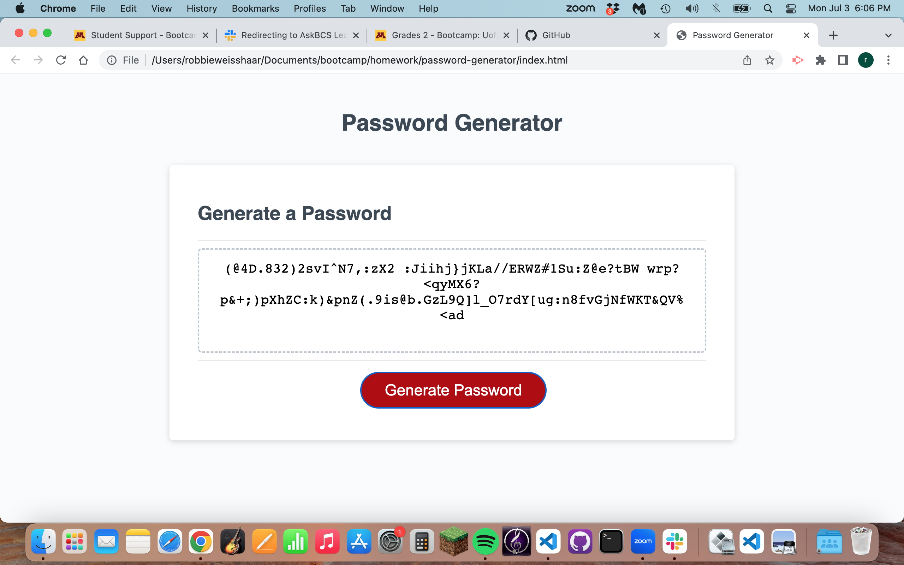

# Password - Generator Project

## Purpose:
- For this project, I wanted to create a password generator that would automatically create a password based on the criteria I need.

## Instructions for Use:
- If you would like a password generated, you would first have to click the button labelled "Generate Password."
- Then you will be asked a series of prompts:
  - How many characters would you like it to be? (Must be between 8-128 characters. If it is any more or any less, you will be asked to restart.)
  - Would you like lower case letters?
  - Would you like upper case letters?
  - Would you like numeric characters?
  - And lastly, would you like any symbols?

- After the prompts have been answered, a randomly generated password will be displayed in the textbox on the screen. 
- You should be able to repeat this as many times as you would like.

## Starter-Code:
- In this repo, there is a folder entitled "starter-code". This is the code that was given to me to work with (HTML, CSS, and basic JS). 
- I also received help from a tutor with creating the for loop near the bottom of the JS file.

## Screen Shot:

## Link to Working Webpage:
https://rweisshaar1.github.io/password-generator/